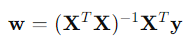
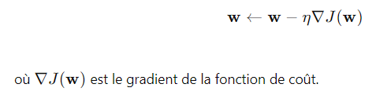
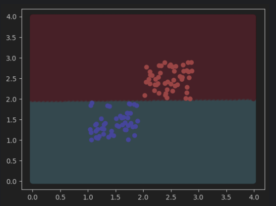
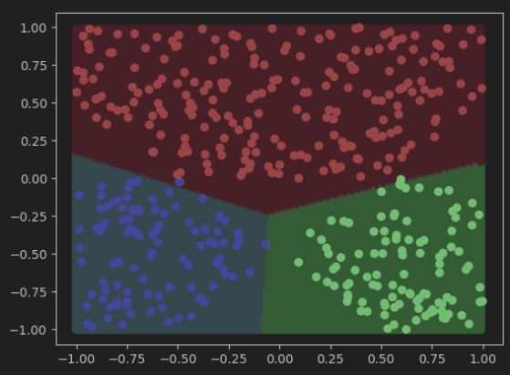
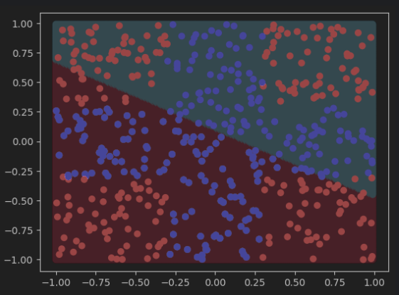
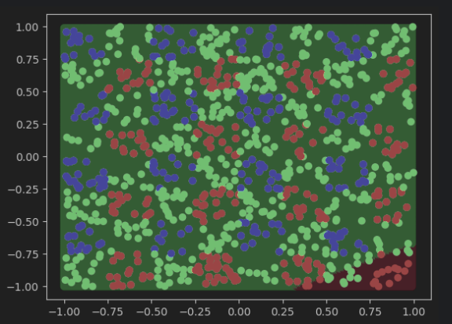
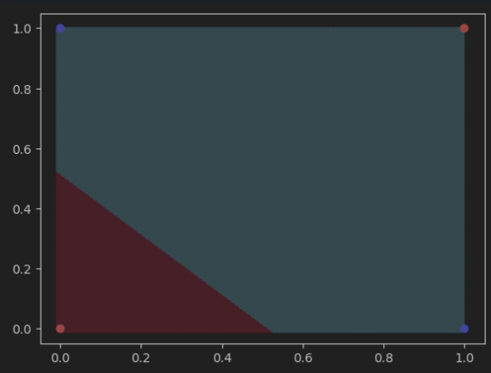
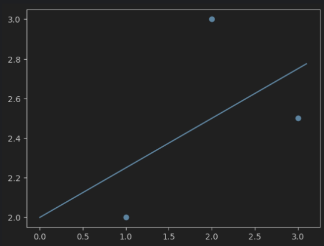

## Introduction

Nous avons implémenté et testé plusieurs méthodes pour chaque type de tâche, en utilisant des règles et des algorithmes bien connus pour l'implémentation
du modèle linéaire. 
Les sections suivantes décrivent les méthodes employées et les différents cas de tests réalisés.

## Méthodes Utilisées

### Classification

Pour les tâches de classification, nous avons utilisé deux méthodes principales :

1. **Règle de Rosenblatt** :
    - C'est un algorithme de classification linéaire basé sur la règle de mise à jour du perceptron.
    - Equation de mise à jour :
   
        
2. **Régression Logistique** :
    - Utilisée pour la classification binaire avec une sortie probabiliste.
    - Fonction sigmoïde :
      
        

### Régression

Pour les tâches de régression, nous avons utilisé les méthodes suivantes :

1. **Pseudo-Inverse** :
    - Utilisée pour trouver la solution optimale dans les moindres carrés.
    - Equation :
   
        

2. **Descente de Gradient** :
    - Utilisée pour minimiser la fonction de coût en ajustant les poids de manière itérative.
    - Mise à jour des poids :
   
        

## Cas de Tests

Nous avons évalué nos modèles sur les cas de tests suivants :

1. **Classification Linéaire Simple** (`ml_classification_linear_simple`)
2. **Classification Linéaire Multiple** (`ml_classification_linear_multiple`)
3. **Classification Linéaire Multiple 3 Classes** (`ml_classification_multi_linear_3_classes`)
3. **Classification CROSS** (`ml_classification_cross`)
4. **Classification MULTI CROSS** (`ml_classification_multi_cross`)
5. **Classification XOR** (`ml_classification_xor`)
6. **Régression Linéaire Simple en 2D** (`ml_regression_linear_simple_2D`)
7. **Régression Linéaire Simple en 3D** (`ml_regression_linear_simple_3D`)
8. **Régression Linéaire Complexe en 3D** (`ml_regression_linear_tricky_3D`)
9. **Régression Non-Linéaire Simple en 2D** (`ml_regression_non_linear_simple_2D`)
10. **Régression Non-Linéaire Simple en 3D** (`ml_regression_non_linear_simple_3D`)

## Résultats et Visualisations

Pour chaque cas de test, nous avons généré et inclus des images des courbes et des graphiques résultants. Ces visualisations permettent de mieux comprendre les performances et les comportements des modèles appliqués à différents types de données.

- **ml_classification_linear_simple** : 

     

- **ml_classification_linear_multiple** : 

     

- **ml_classification_linear_multiple** :

  

- **ml_classification_cross** :

     

- **ml_classification_multi_cross** :

     

- **ml_classification_xor** : 

     

- **ml_regression_linear_simple_2D** : 

     

- **ml_regression_linear_simple_3D** : 
      
     

- **ml_regression_linear_tricky_3D** : 

     

- **ml_regression_non_linear_simple_2D** : 

     

- **ml_regression_non_linear_simple_3D** : 

     

Pour plus d'informations sur l'implémentation et les détails techniques, veuillez consulter le code source et les commentaires associés dans les fichiers du projet.

---

N'hésitez pas à explorer les fichiers du projet pour mieux comprendre les implémentations et les résultats obtenus !
