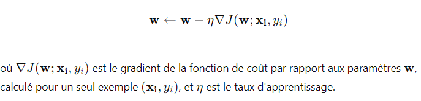
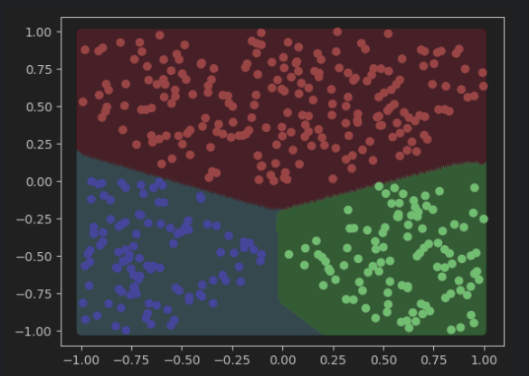
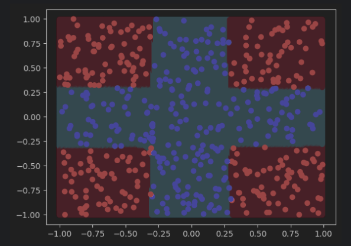
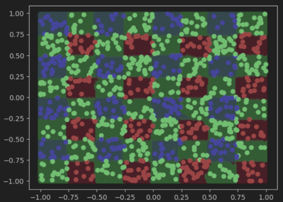
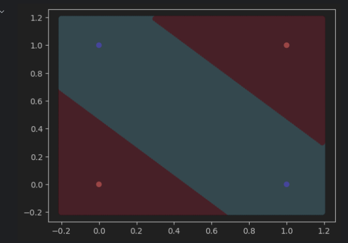
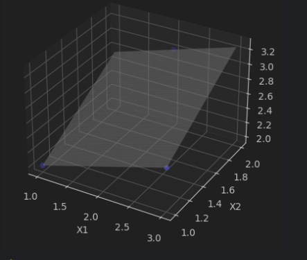
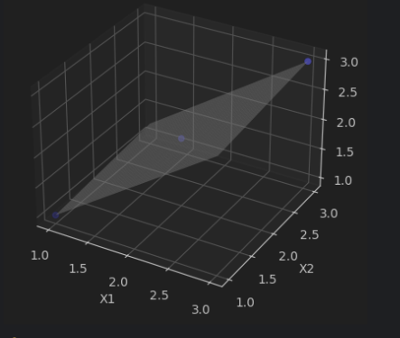
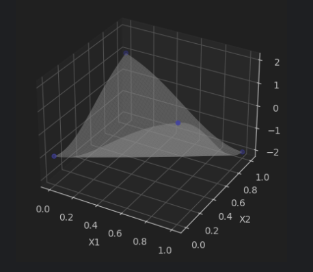

## Introduction

Nous avons implémenté et testé plusieurs cas de tests en utilisant l'algorithme de descente de gradient stochastique (SGD) pour le MLP. 
Les sections suivantes décrivent la méthode employée et les différents cas de tests réalisés.

## Méthodes Utilisées

### Descente de Gradient Stochastique (SGD)

Pour les tâches de classification et de régression, nous avons utilisé la descente de gradient stochastique (SGD) pour optimiser les paramètres du MLP :

- **Descente de Gradient Stochastique (SGD)** :
    - Utilisée pour minimiser la fonction de coût en ajustant les poids de manière itérative pour chaque exemple de données.
    - Mise à jour des poids :
  
       
    
## Cas de Tests

Nous avons évalué nos modèles MLP sur les cas de tests suivants :

1. **1ere lancé** (`Dim = [32, 3] lr=0.1 epochs=100`)
2. **Classification Linéaire Multiple** (`mlp_classification_linear_multiple`)
3. **Classification Linéaire Multiple 3 Classes** (`mlp_classification_multi_linear_3_classes`)
4. **Classification CROSS** (`mlp_classification_cross`)
5. **Classification MULTI CROSS** (`mlp_classification_multi_cross`)
6. **Classification XOR** (`mlp_classification_xor`)
7. **Régression Linéaire Simple en 2D** (`mlp_regression_linear_simple_2D`)
8. **Régression Linéaire Simple en 3D** (`mlp_regression_linear_simple_3D`)
9. **Régression Linéaire Complexe en 3D** (`mlp_regression_linear_tricky_3D`)
10. **Régression Non-Linéaire Simple en 2D** (`mlp_regression_non_linear_simple_2D`)
11. **Régression Non-Linéaire Simple en 3D** (`mlp_regression_non_linear_simple_3D`)

## Résultats et Visualisations

Pour chaque cas de test, nous avons généré et inclus des images des courbes et des graphiques résultants. Ces visualisations permettent de mieux comprendre les performances et les comportements des modèles appliqués à différents types de données.

- **mlp_classification_linear_simple** : 

     

- **mlp_classification_linear_multiple** : 

     

- **mlp_classification_multi_linear_3_classes** :

  

- **mlp_classification_cross** : 

     

- **mlp_classification_multi_cross** :

    

- **mlp_classification_xor** : 

     

- **mlp_regression_linear_simple_2D** : 

     

- **mlp_regression_linear_simple_3D** : 

     

- **mlp_regression_linear_tricky_3D** : 

     

- **mlp_regression_non_linear_simple_2D** : 

     

- **mlp_regression_non_linear_simple_3D** :

     

## Exprimentation avec la datasets

Nous avons fait des experimentation avec notre dataset sur le mlp et voici les résultat observé :

1. **Classification Linéaire Simple** (`mlp_classification_linear_simple`)
2. **Classification Linéaire Multiple** (`mlp_classification_linear_multiple`)
3. **Classification Linéaire Multiple 3 Classes** (`mlp_classification_multi_linear_3_classes`)
4. **Classification CROSS** (`mlp_classification_cross`)
5. **Classification MULTI CROSS** (`mlp_classification_multi_cross`)
6. **Classification XOR** (`mlp_classification_xor`)
7. **Régression Linéaire Simple en 2D** (`mlp_regression_linear_simple_2D`)
8. **Régression Linéaire Simple en 3D** (`mlp_regression_linear_simple_3D`)
9. **Régression Linéaire Complexe en 3D** (`mlp_regression_linear_tricky_3D`)
10. **Régression Non-Linéaire Simple en 2D** (`mlp_regression_non_linear_simple_2D`)
11. **Régression Non-Linéaire Simple en 3D** (`mlp_regression_non_linear_simple_3D`)

## Résultats et Visualisations

Pour chaque expérimentation, nous avons généré et inclus des images des courbes et des graphiques résultants. Ces visualisations permettent de mieux comprendre les performances et les comportements des modèles appliqués à différents parametres.

- **mlp_classification_linear_simple** : 

     

- **mlp_classification_linear_multiple** : 

     

- **mlp_classification_multi_linear_3_classes** :

  

- **mlp_classification_cross** : 

     

- **mlp_classification_multi_cross** :

    

- **mlp_classification_xor** : 

     

- **mlp_regression_linear_simple_2D** : 

     

- **mlp_regression_linear_simple_3D** : 

     

- **mlp_regression_linear_tricky_3D** : 

     

- **mlp_regression_non_linear_simple_2D** : 

     

- **mlp_regression_non_linear_simple_3D** :

     

Pour plus d'informations sur l'implémentation et les détails techniques, veuillez consulter le code source et les commentaires associés dans les fichiers du projet.

---

N'hésitez pas à explorer les fichiers du projet pour mieux comprendre les implémentations et les résultats obtenus !
