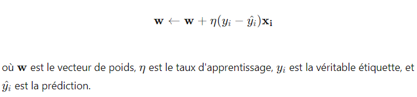
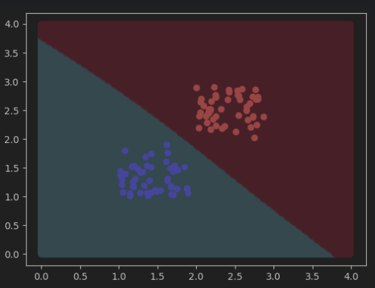
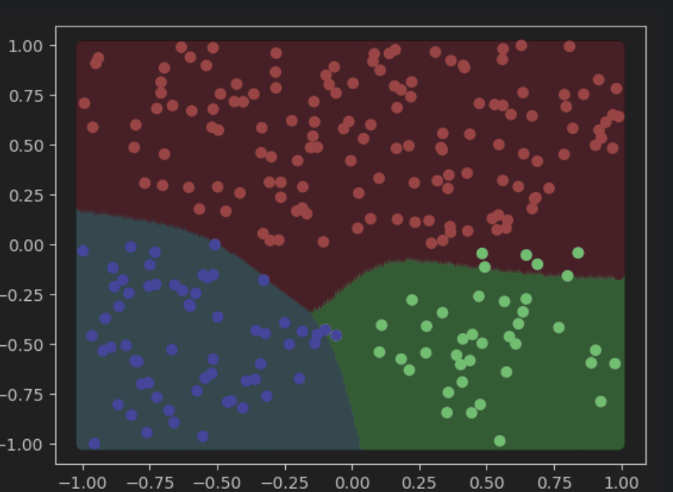
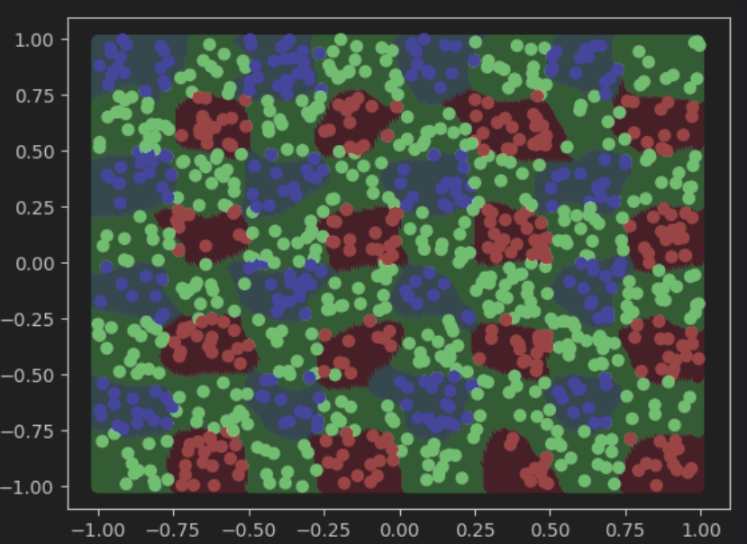
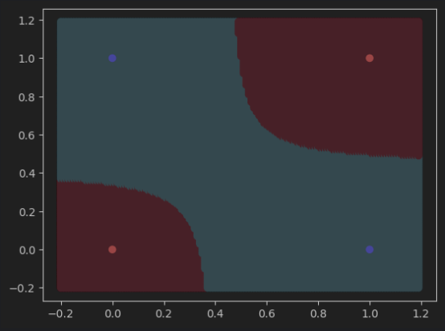
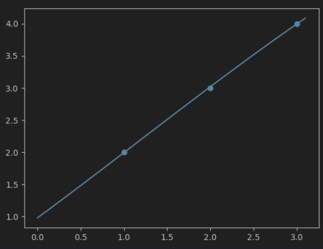
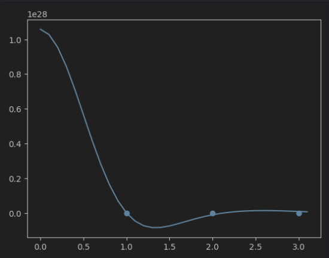
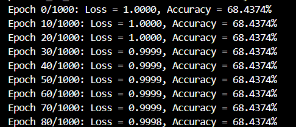

## Introduction

Nous avons implémenté plusieurs approches incluant la règle de Rosenblatt pour la classification, l'algorithme de Lloyd (qui donne K-means) pour la configuration des centres des RBF, 
ainsi que la régression inverse/pseudo-inverse pour la régression pour le rbf. 
Les sections suivantes détaillent ces méthodes et présentent les cas de tests réalisés.

## Méthodes Utilisées

### Classification

Pour la classification, nous avons utilisé deux méthodes principales :

1. **Règle de Rosenblatt** :
    - Algorithme de classification linéaire utilisé pour séparer les classes en utilisant des fonctions de base radiales (RBF).
    - Mise à jour des poids :

         
2. **Algorithme de Lloyd (K-means)** :
    - Utilisé pour déterminer les centres des RBF de manière non supervisée.
    - Les centres des RBF sont ajustés pour minimiser la distance intra-cluster et maximiser la distance inter-cluster.

### Régression

Pour la régression, nous avons utilisé la méthode de régression inverse/pseudo-inverse :

- **Régression Inverse/Pseudo-Inverse** :
    - Utilisée pour ajuster les poids des RBF dans le modèle de régression.
    - Equation :

      

## Cas de Tests

Nous avons évalué nos modèles RBF sur les cas de tests suivants :

1. **Classification Linéaire Simple** (`rbf_classification_linear_simple`)
2. **Classification Linéaire Multiple** (`rbf_classification_linear_multiple`)
3. **Classification Linéaire Multiple 3 Classes** (`rbf_classification_multi_linear_3_classes`)
4. **Classification CROSS** (`rbf_classification_cross`)
5. **Classification MULTI CROSS** (`rbf_classification_multi_cross`)
6. **Classification XOR** (`rbf_classification_xor`)
7. **Régression Linéaire Simple en 2D** (`rbf_regression_linear_simple_2D`)
8. **Régression Linéaire Simple en 3D** (`rbf_regression_linear_simple_3D`)
9. **Régression Linéaire Complexe en 3D** (`rbf_regression_linear_tricky_3D`)
10. **Régression Non-Linéaire Simple en 2D** (`rbf_regression_non_linear_simple_2D`)
11. **Régression Non-Linéaire Simple en 3D** (`rbf_regression_non_linear_simple_3D`)

## Résultats et Visualisations

Pour chaque cas de test, nous avons généré et inclus des images des courbes et des graphiques résultants. Ces visualisations permettent de mieux comprendre les performances et les comportements des modèles appliqués à différents types de données.

- **rbf_classification_linear_simple** :

  

- **rbf_classification_linear_multiple** :

  

- **rbf_classification_multi_linear_3_classes** :

  

- **rbf_classification_cross** :

  

- **rbf_classification_multi_cross** :

  

- **rbf_classification_xor** :

  

- **rbf_regression_linear_simple_2D** :

  

- **rbf_regression_linear_simple_3D** :

  

- **rbf_regression_linear_tricky_3D** :

  

- **rbf_regression_non_linear_simple_2D** :

  

- **rbf_regression_non_linear_simple_3D** :

  

---

Suite au lancement de l'entraînement avec le dataset, avec les paramètres Epoch : 500, Learning Rate : 0.01, Gamma : 1.0 et Cluster Num : 200, nous avons observé que la fonction de perte (loss) ne diminue pas de manière significative au fil des époques. Cela suggère que le modèle ne parvient pas à apprendre efficacement à partir des données. L'augmentation du taux d'apprentissage (learning rate) et du paramètre gamma 
n'a pas produit l'amélioration escomptée dans les performances du modèle.

   

La perte commence à 1.0000 pour les époques 0, 10 et 20. À partir de l'époque 30, on constate une très légère baisse à 0.9999, qui se maintient jusqu'à l'époque 70. Finalement, à l'époque 80, la perte diminue encore très légèrement pour atteindre 0.9998.
Cette diminution est extrêmement faible, passant de 1.0000 à 0.9998 sur 80 époques, ce qui représente une réduction de seulement 0.0002 ou 0.02%.
Il est important de noter que malgré cette légère baisse de la perte, l'exactitude (accuracy) reste constante à 68.4374% tout au long des époques affichées.
Cette évolution indique que le modèle apprend, mais à un rythme extrêmement lent, et que les améliorations sont minimales sur la plage d'époques observée.

   

---

Pour plus de détails sur l'implémentation et les résultats, veuillez consulter le code source et les commentaires associés dans les fichiers du projet.

---

N'hésitez pas à explorer les fichiers du projet pour mieux comprendre les implémentations et les résultats obtenus !
