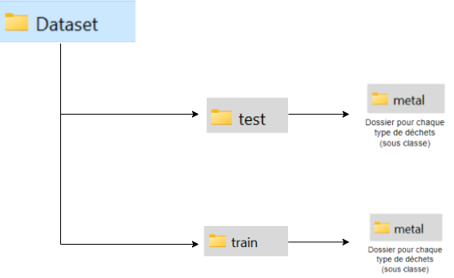

## Dataset

### Description

Notre Dataset Finale est utilisé pour entraîner et tester le modèle de classification des déchets. Il est organisé en trois catégories principales, chacune correspondant à une couleur de poubelle différente : jaune, rouge et verte.

### Structure du Dataset

1. **Jaune :**
    - `cardboard` (1234 images)
    - `metal` (1269 images)
    - `paper` (1149 images)
    - `plastic` (1307 images)

2. **Rouge :**
    - `motherboard` (914 images)
    - `processor` (652 images)
    - `ram` (942 images)

3. **Vert :**
    - `glass` (1295 images)

### Nomenclature des Fichiers

Les fichiers d'images suivent une nomenclature spécifique : `type_count.extension` (par exemple, `metal_1.jpg`).

### Résolution des Images

Toutes les images du dataset ont une résolution de 64 x 64 pixels.

### Répartition des Données

- 10% des images sont utilisées pour le jeu de test.
- Le reste des images est utilisé pour l'entraînement.

### Hiérarchie du Dataset

Voici une illustration de la hiérarchie du dataset :



### Exemple de Structure de Répertoire

```plaintext
dataset/
├── jaune/
│   ├── cardboard/
│   │   ├── train/
│   │   │   ├── cardboard_1.jpg
│   │   │   ├── cardboard_2.jpg
│   │   │   └── ...
│   │   └── test/
│   │       ├── cardboard_1.jpg
│   │       ├── cardboard_2.jpg
│   │       └── ...
│   ├── metal/
│   │   ├── train/
│   │   │   ├── metal_1.jpg
│   │   │   ├── metal_2.jpg
│   │   │   └── ...
│   │   └── test/
│   │       ├── metal_1.jpg
│   │       ├── metal_2.jpg
│   │       └── ...
│   ├── paper/
│   │   ├── train/
│   │   │   ├── paper_1.jpg
│   │   │   ├── paper_2.jpg
│   │   │   └── ...
│   │   └── test/
│   │       ├── paper_1.jpg
│   │       ├── paper_2.jpg
│   │       └── ...
│   └── plastic/
│       ├── train/
│       │   ├── plastic_1.jpg
│       │   ├── plastic_2.jpg
│       │   └── ...
│       └── test/
│           ├── plastic_1.jpg
│           ├── plastic_2.jpg
│           └── ...
├── rouge/
│   ├── motherboard/
│   │   ├── train/
│   │   │   ├── motherboard_1.jpg
│   │   │   ├── motherboard_2.jpg
│   │   │   └── ...
│   │   └── test/
│   │       ├── motherboard_1.jpg
│   │       ├── motherboard_2.jpg
│   │       └── ...
│   ├── processor/
│   │   ├── train/
│   │   │   ├── processor_1.jpg
│   │   │   ├── processor_2.jpg
│   │   │   └── ...
│   │   └── test/
│   │       ├── processor_1.jpg
│   │       ├── processor_2.jpg
│   │       └── ...
│   └── ram/
│       ├── train/
│       │   ├── ram_1.jpg
│       │   ├── ram_2.jpg
│       │   └── ...
│       └── test/
│           ├── ram_1.jpg
│           ├── ram_2.jpg
│           └── ...
└── vert/
    └── glass/
        ├── train/
        │   ├── glass_1.jpg
        │   ├── glass_2.jpg
        │   └── ...
        └── test/
            ├── glass_1.jpg
            ├── glass_2.jpg
            └── ...
```