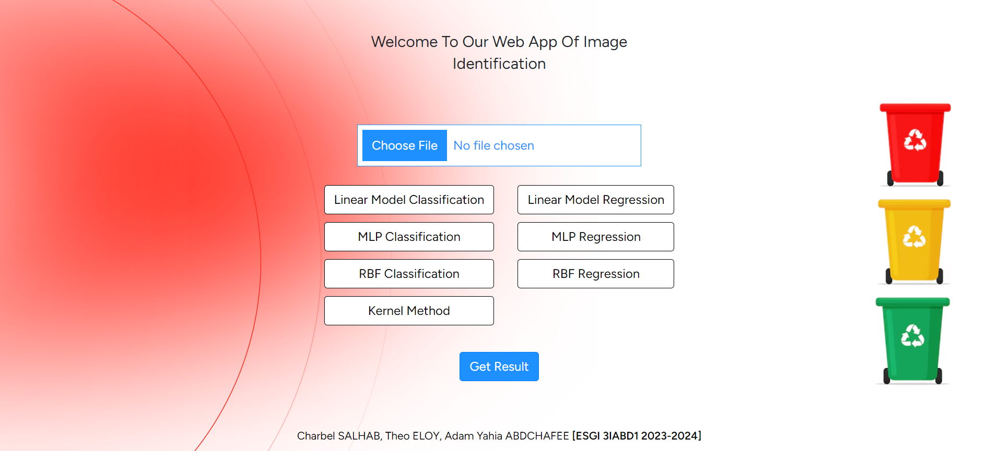

# Étape 1 du projet

### Problématiques Applicatives Choisies

Nous avons identifié plusieurs problématiques applicatives pertinentes pour notre projet de classification des déchets. Ces problématiques incluent :

- Détection et classification correcte des différents types de déchets.
- Répartition des déchets dans les catégories appropriées (jaune, rouge, verte).
- Optimisation de la précision du modèle de classification pour chaque catégorie de déchets.

### Création du Repository Git

Pour organiser et suivre notre travail de développement, nous avons créé un repository Git dédié à ce projet. Ce repository nous permet de gérer efficacement le code source, de collaborer en équipe et de suivre l'historique des modifications.

Lien vers le repository Git : [3BigData](https://github.com/yahia-adam/3BigData)

### Pistes de Constitution du Dataset

Pour constituer notre dataset, nous avons suivi les étapes suivantes :

1. **Collecte des Données** :
    - Nous avons développé un script Python pour importer des images de différents types de déchets depuis Bing.
    - Nous avons également intégré et mélangé plusieurs datasets existants disponibles sur Kaggle pour compléter notre dataset.

2. **Classification des Images** : Tri des images en trois catégories principales basées sur la couleur des poubelles (jaune, rouge, verte) et création de sous-catégories spécifiques.

3. **Prétraitement des Images** : Redimensionnement des images à une résolution uniforme de 64 x 64 pixels et renommage des fichiers selon la nomenclature `type_count.extension`.

4. **Répartition des Données** : Division du dataset en ensembles d'entraînement et de test, avec 10% des images dédiées au test et le reste à l'entraînement.

### Résolution des Images

Toutes les images du dataset ont une résolution de 64 x 64 pixels.

### Nomenclature des Fichiers

Les fichiers d'images suivent une nomenclature spécifique : `type_count.extension` (par exemple, `metal_1.jpg`).

---

En suivant ces étapes, nous avons constitué un dataset robuste et varié, prêt à être utilisé pour entraîner et tester notre modèle de classification des déchets.

# Étape 2 du projet

### Modèle Linéaire

Nous avons appliqué un modèle linéaire aux cas de tests ainsi qu'à une partie du dataset en cours de constitution. Cela nous a permis d'établir une baseline pour évaluer les performances de base du modèle.

### Transformation Non Linéaire

Pour les cas où le modèle linéaire a échoué (cas 'KO'), nous avons exploré des transformations non linéaires afin d'améliorer les résultats de classification. Ces transformations ont aidé à capturer des relations plus complexes dans les données.

### PMC (Perceptron Multi-Couche)

Nous avons également appliqué des Perceptrons Multi-Couche (PMC) aux cas de tests ainsi qu'à une portion du dataset en cours de constitution. Les PMC ont montré une amélioration significative par rapport au modèle linéaire grâce à leur capacité à modéliser des relations non linéaires.

# Livrables

- **Projet de test opérationnel et sources** : Le code source du projet, y compris les modèles de classification et les scripts de prétraitement des données, est disponible dans le repository Git.
- **Rapport commentant les résultats observés** : Un rapport détaillé expliquant les résultats obtenus avec les différents modèles, les transformations non linéaires appliquées et les performances comparatives.

# Début d'implémentation de l'application (tuyauterie)

Nous avons commencé à implémenter l'application web en utilisant Laravel. Les principales fonctionnalités incluent :

- Upload d'image de déchet.
- Classification automatique du déchet.
- Affichage du résultat de la classification.

